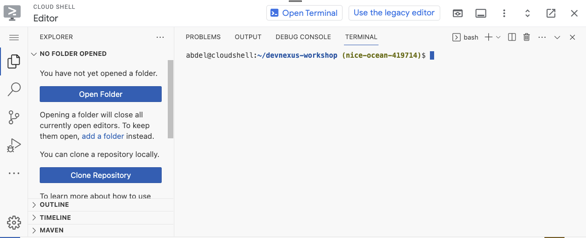

# LangChain4j in Jakarta EE and MicroProfile
This example demonstrates LangChain4J in a Jakarta EE / MicroProfile application on Open Liberty. The application is a chatbot built with LangChain4J and uses Jakarta CDI, Jakarta RESTful Web Services, Jakarta WebSocket, MicroProfile Config, MicroProfile Metrics, and MicroProfile OpenAPI features.

## Prerequisites:

- [Java 17](https://developer.ibm.com/languages/java/semeru-runtimes/downloads)
- Hugging Face API Key
  - Sign up and log in to https://huggingface.co.
  - Go to [Access Tokens](https://huggingface.co/settings/tokens). 
  - Create a new access token with `read` role.
  
## Environment Set Up
Clone this [Repo](https://github.com/aboullaite/devnexus-workshop) 

```
git clone https://github.com/aboullaite/devnexus-workshop.git

cd devnexus-workshop
```

Click on `Open Folder` on the Explorer window on navigate to `/home/YOUR_USERNAME/devnexus-workshop`



You should view and edit the source code of the application

Set the following environment variables:

```
export HUGGING_FACE_API_KEY=<your Hugging Face read token>
```

## Start the application

Use the Maven wrapper to start the application by using the [Liberty dev mode](https://openliberty.io/docs/latest/development-mode.html):

```
./mvnw liberty:dev
```

## Change Cloud Shell Web Preview Port

Click the button below > Change Port > Enter value 9080 > Change and Preview


A new Tab will open with the Preview of the application

## Try out the application

- At the prompt, try the following message examples:
  - ```
    What are large language models?
    ```
  - ```
    Which are the most used models?
    ```
  - ```
    any documentation?
    ```

### Try out other models

Navigate to the the OpenAPI UI by appending `openapi/ui` to the Cloud Shell URL after `BASE_URL/cloudshell.dev/`. for the following 3 REST APIs:

- [HuggingFaceLanguageModel](https://github.com/langchain4j/langchain4j/blob/main/langchain4j-hugging-face/src/main/java/dev/langchain4j/model/huggingface/HuggingFaceLanguageModel.java)
  - Expand the GET `/api/model/language` API.
    1. Click the **Try it out** button.
    2. Type `When was langchain4j launched?`, or any question, in the question field.
    3. Click the **Execute** button.
  - Alternatively, open a new Terminal Tab in Cloud Shell and run the following `curl` command from a command-line session:
    - ```
      curl 'http://localhost:9080/api/model/language?question=When%20was%20langchain4j%20launched%3F'
      ```
- [HuggingFaceChatModel](https://github.com/langchain4j/langchain4j/blob/main/langchain4j-hugging-face/src/main/java/dev/langchain4j/model/huggingface/HuggingFaceChatModel.java)
  - expand the GET `/api/model/language` API
    1. Click the **Try it out** button.
    2. Type `Which are the most used Large Language Models?`, or any question, in the question field.
    3. Click the **Execute** button.
  - Alternatively, open a new Terminal Tab in Cloud Shell and run the following `curl` command from a command-line session:
    - ```
      curl -s 'http://localhost:9080/api/model/chat?userMessage=Which%20are%20the%20most%20used%20Large%20Language%20models%3F' | jq
      ```
- [InProcessEmbeddingModel](https://github.com/langchain4j/langchain4j-embeddings)
  - expand the GET `/api/model/similarity` API
    1. Click the **Try it out** button.
    2. Type `I like Jakarta EE and MicroProfile.`, or any text, in the the **text1** field.
    3. Type `I like Python language.`, or any text, in the the **text2** field. 
    3. Click the **Execute** button.
  - Alternatively, open a new Terminal Tab in Cloud Shell and run the following `curl` command from a command-line session:
    - ```
      curl -s 'http://localhost:9080/api/model/similarity?text1=I%20like%20Jakarta%20EE%20and%20MicroProfile.&text2=I%20like%20Python%20language.' | jq
      ```

## Running the tests

Because you started Liberty in dev mode, you can run the provided tests by pressing the `enter/return` key from the command-line session where you started dev mode.

If the tests pass, you see a similar output to the following example:

```
[INFO] -------------------------------------------------------
[INFO]  T E S T S
[INFO] -------------------------------------------------------
[INFO] Running it.dev.langchan4j.example.ChatServiceIT
[INFO] ...
[INFO] Tests run: 1, Failures: 0, Errors: 0, Skipped: 0, Time elapsed: 0.439 s...
[INFO] ...
[INFO] Running it.dev.langchan4j.example.ModelResourceIT
[INFO] Tests run: 3, Failures: 0, Errors: 0, Skipped: 0, Time elapsed: 0.733 s...
[INFO] 
[INFO] Results:
[INFO] 
[INFO] Tests run: 4, Failures: 0, Errors: 0, Skipped: 0
```

When you are done checking out the service, exit dev mode by pressing `Ctrl+C` in the command-line session where you ran Liberty, or by typing `q` and then pressing the `enter/return` key.
