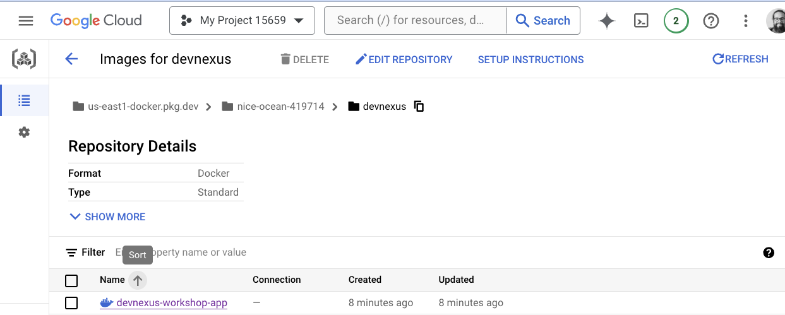

# Containerize the application

## Using Docker

Run the the command below to build a docker image

```
docker build . -t devnexus-workshop-app -f Dockerfile.jvm
```

Run the container locally

```
docker run -p 9080:9080 -e HUGGING_FACE_API_KEY=$HUGGING_FACE_API_KEY devnexus-workshop-app
```

Use the Web Preview in the Cloud Shell to Open the App

## Using Buildpacks 

Follow these instructions to install the pack CLI locallaly:

[Pack CLI Installation Instructions](https://buildpacks.io/docs/for-platform-operators/how-to/integrate-ci/pack/)

Install the latest version of buildpacks in the Cloud CLI

```
(curl -sSL "https://github.com/buildpacks/pack/releases/download/v0.33.0-rc1/pack-v0.33.0-rc1-linux.tgz" | sudo tar -C /usr/local/bin/ --no-same-owner -xzv pack)
```

Set the default builder

```
pack config default-builder paketobuildpacks/builder-jammy-base
```

Check out the project.toml file in the route dir. It should contain the following config:

```
[[build.env]]
    name = "BP_JAVA_APP_SERVER"
    value = "liberty"

[[build.env]]
    name = "BP_MAVEN_BUILT_ARTIFACT"
    value ="target/*.[ejw]ar src/main/liberty/config/*"

[[build.buildpacks]]
  uri = "docker://gcr.io/paketo-buildpacks/eclipse-openj9"

[[build.buildpacks]]
  uri = "docker://gcr.io/paketo-buildpacks/java"
```

Now build you OCI image

```
pack build devnexus-workshop-app
```

We can use buildpacks to generate a Software Bill of Materials (SBOM) using the following command

```
pack sbom download devnexus-workshop-app
```

## IMPORTANT: Push the container image to Artifact Registry

```
export PROJECT_ID=$(gcloud config get-value project)
gcloud artifacts repositories create devnexus --location us-east1 --repository-format docker
docker tag devnexus-workshop-app us-east1-docker.pkg.dev/$PROJECT_ID/devnexus/devnexus-workshop-app
docker push us-east1-docker.pkg.dev/$PROJECT_ID/devnexus/devnexus-workshop-app
```

Open [Artifact Registry UI](https://console.cloud.google.com/artifacts/) and navigate to the `devnexus` repository to see the container image like the screen below


